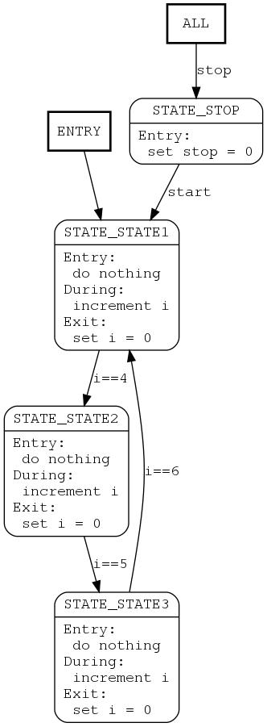

# Graphing of MACRO based Finite State Machine (FSM) using graphviz

This code parses a finite state machine using a macro code implementation and generates a 'dot' graph file to be graphed by graphviz.

## Requirements

The following are required to graph the state machine:

- This runs on Linux only, if you don't have a Linux box, use [Windows Subsystem for Linux](https://docs.microsoft.com/en-us/windows/wsl/install-win10)
- Compile this project to generate the executable 'smgraph'
- Create a state machine using macro code located in this repository: [MACRO based Finite State Machine (fsm)](https://github.com/mfilippa/fsm). Only file needed is 'fsm.h'

## Usage

- run smgraph with the file containing the state machine, this will create a 'dot' file
- run graphviz on the generated 'dot' file

Syntax:
```
$ smgraph <fsm_file.c> <graph.dot>
$ dot -T<ext> <graph.dot> -o <output.<ext>>
```

Example:
```
$ smgraph example.c fsm.dot
$ dot -Tjpg fsm.dot -o fsm.jpg
```

The file 'example.c' will produce the following code and graph:

```
digraph G {
    node [shape=box,fontname=courier];
    ENTRY [label="ENTRY"];
    ENTRY -> STATE_STATE1;
    STATE_STATE1 [label="=== STATE_STATE1 ===\nEntry:\l  do nothing\lDuring:\l  increment i\lExit:\l  set i = 0\l"];
    STATE_STATE2 [label="=== STATE_STATE2 ===\nEntry:\l  do nothing\lDuring:\l  increment i\lExit:\l  set i = 0\l"];
    STATE_STATE3 [label="=== STATE_STATE3 ===\nEntry:\l  do nothing\lDuring:\l  increment i\lExit:\l  set i = 0\l"];
    STATE_STOP [label="=== STATE_STOP ===\n"];
    ALL [label="ALL"];
    ALL -> STATE_STOP [fontname=courier,label="stop"];
    STATE_STATE1 -> STATE_STATE2 [fontname=courier,label="i==4"];
    STATE_STATE2 -> STATE_STATE3 [fontname=courier,label="i==5"];
    STATE_STATE3 -> STATE_STATE1 [fontname=courier,label="i==6"];
}
```

